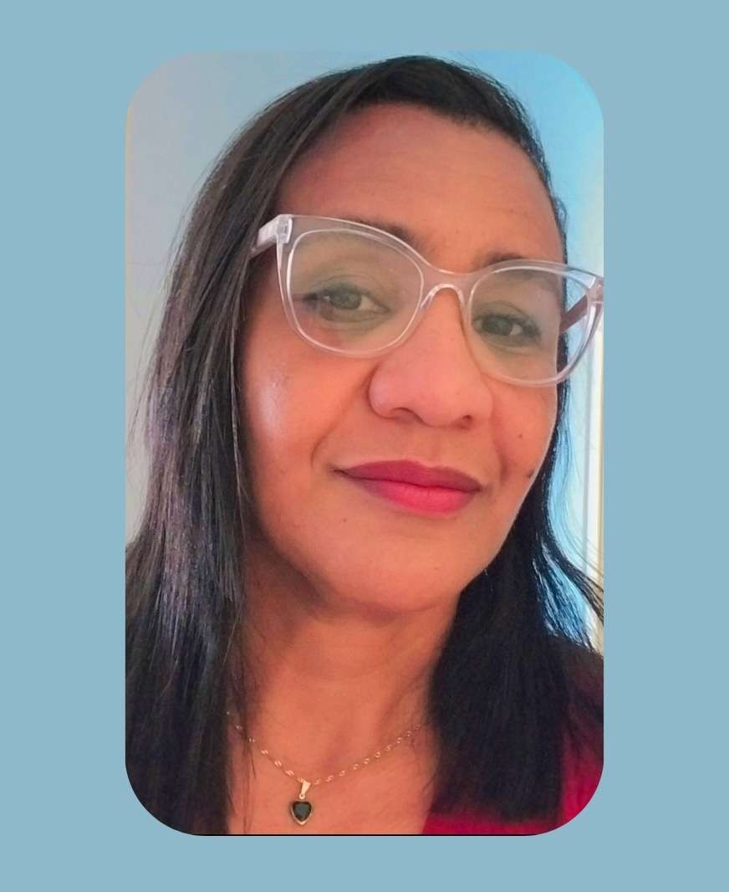
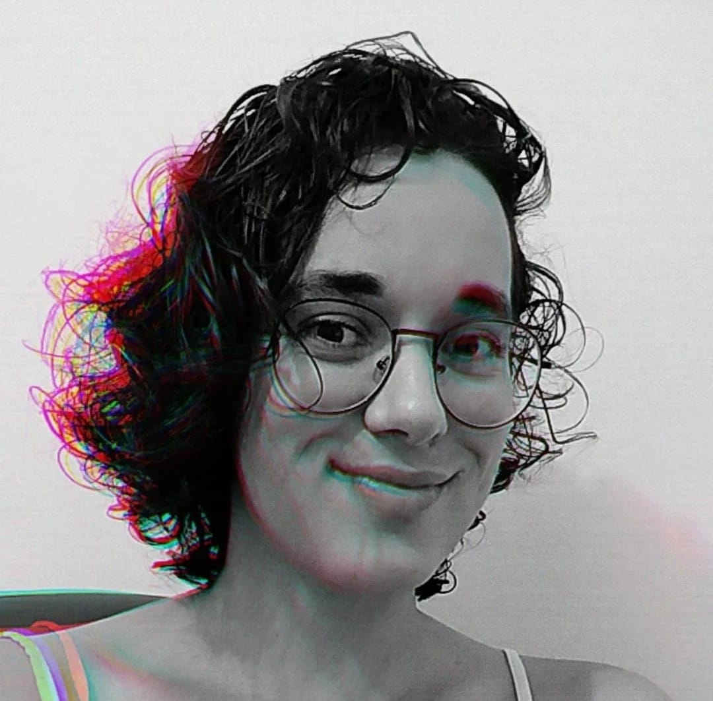
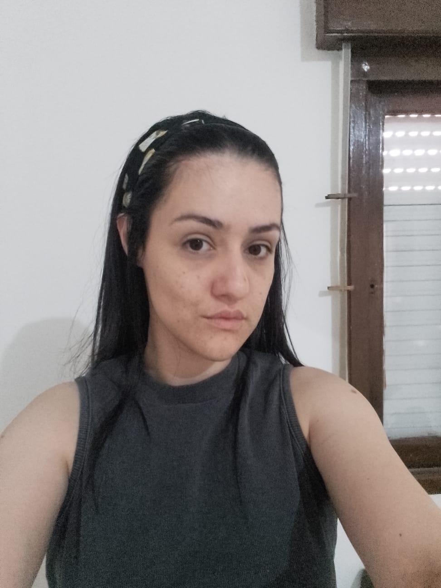
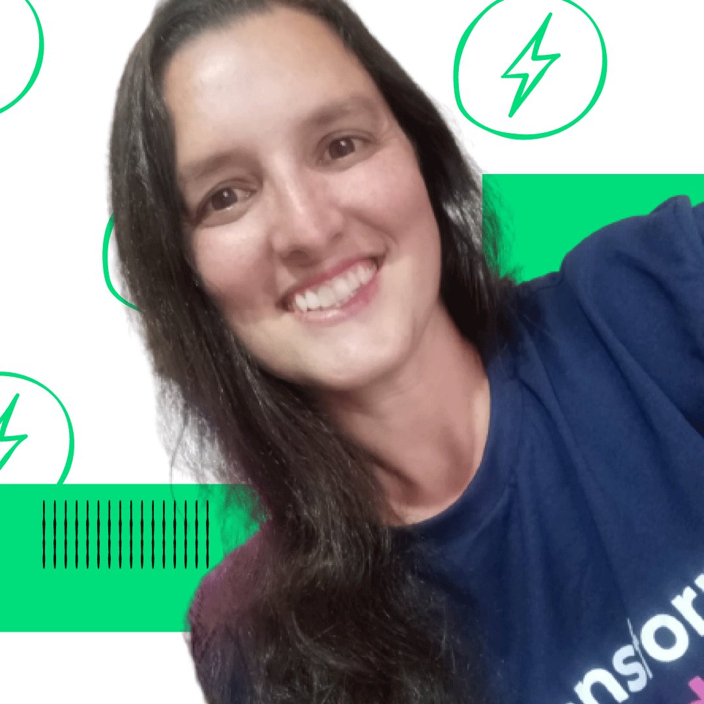

# Exercícios Resolvidos pelo Squad Bertha Lutz :)

Este repositório contém todos os exercícios de python da semana 3 resolvidos pelo squad Bertha Lutz, composto por: 

|Laura Perroni| Adriana Cristina | Mariana Choratto| Erika Alves | Raissa Carneiro | Claudia Azambuja |
|---|---|---|---|---|---|
|||||| |

|Vivian Rosana| Leidejane da Silva |  Gabriela Sampaio | Elizabeth Pereira | Carme Fernandes |
|---|---|---|---|---|
||||||

#### Nomes completos:
* Laura Perroni Quadros da Silva ok
* Adriana Cristina Ferraresi ok
* Carme Fernandes 
* Elizabeth Pereira 
* Claudia Azambuja ok
* Mariana Choratto ok
* Vivian Rosana Carrillo Cuentas ok
* Erika Alves Malaquias  ok
* Raissa Carneiro Castro ok
* Leidejane Da Silva Nascimento Da Rosa ok
* Gabriela Sampaio Da Silva ok

## Método de trabalho

* Fizemos reuniões de revisão das atividades de vez em quando, e nos ajudamos em exercícios específicos
* Utilizamos o nosso canal de texto no Discord para iniciarmos a conversa sobre este repositório, e toda a comunicação foi feita lá.
*  Decidimos nos ajudar como equipe e cobrir para nossas colegas que não conseguirem fazer tudo que lhes foi delegado mas que comunicaram-se conosco e tentaram fazer sua parte, pois somos um time e devemos nos ajudar sempre :)
* Cada arquivo .py contém a proposta da atividade e a aluna responsável pela resolução, organizamos por semana e módulo
* Decidimos que cada uma escolheria um exercício para fazer e fizemos um tutorial para nos ajudar a melhor trabalhar: 
    
    Passo-a-passo:

    * Abrir o repositório https://github.com/lauraperroni/exercicios-squad-berthalutz e fazer um fork dele em sua conta;
    * Fazer um clone do seu fork para o repositório local de seu pc;
    * Fazer as atividades combinadas entre nós em seu computador;
    * Cuidado! Antes de fazer git add, commit e push verifique se você está na branch ExerciciosPython_SquadBerthaLutz !!! se não, use: (git checkout ExerciciosPython_SquadBerthaLutz);
    * Após fazer git push pro seu fork, crie uma pull request para o repositório que a Laura criou e a mesma irá fazer o merge para ele com as alterações. 🙂

### Divisão de tarefas entre a Squad =================================================================

#### Divisão de atividades da Semana 3**

**Exercicios do modulo 1- conceitos basicos:**
* Exercicio 1 - Carme
* Exercicio 2- Mariana
* Exercicio 3 - Elizabeth
* Exercicio 4 - Gabriela
* Exercicio 5 - Raissa
* Exercicio 6 - Leidejane
* Exercicio 7- Laura
* Exercicio 8 - claudia
* Exercicio 9 - Erika
* Exercicio 10 - Vivian Rosana 

**Modulo 2- exercícios tomadas de decisão:**
* Exercicio 1 - Carme
* Exercicio 2- Adriana
* Exercicio 3 -Elizabeth 
* Exercicio 4 - Gabriela
* Exercicio 5 - Raissa
* Exercicio 6 - Leidejane
* Exercicio 7 - Vivian Rosana
* Exercicio 8 - Claudia
* Exercicio 9 - Laura
* Exercicio 10 - Erika

**Modulo 3- tuplas, duplas e dicionários:**
* Exercício 1- Laura
* Exercicio 2 - Claudia
* Exercício 3- Mariana
* Exercicio 4 - Carme
* Exercicio 5 - Raissa
* Exercicio 6 - Leidejane

**Modulo 4- Funções**
* Exercicio 1- Mariana
* Exercicio 2 - Claudia
* Exercicio 3 - Laura
* Exercicio 4 - Carme
* Exercicio 5 - Adriana
* Exercicio 6- Laura

#### Divisão de atividades da Semana 4**

# Exercícios da semana 4

## OOP
 (Utilizar a branch: ExerciciosPOO_SquadBerthaLutz)
### Exercício Classes e Objetos 
* Exercício Mercado = Elizabeth Pereira, Laura Perroni, 

## Banco de Dados
### (Utilizar a branch: ExerciciosBancoDeDados_SquadBerthaLutz)
* Exercício Mercado = Elizabeth Pereira, Laura PerroniLeidejane da Rosa, 
